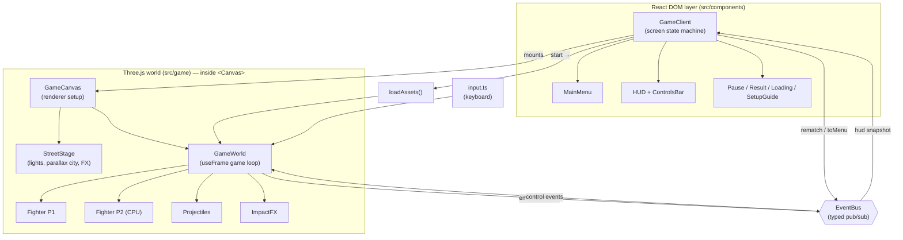
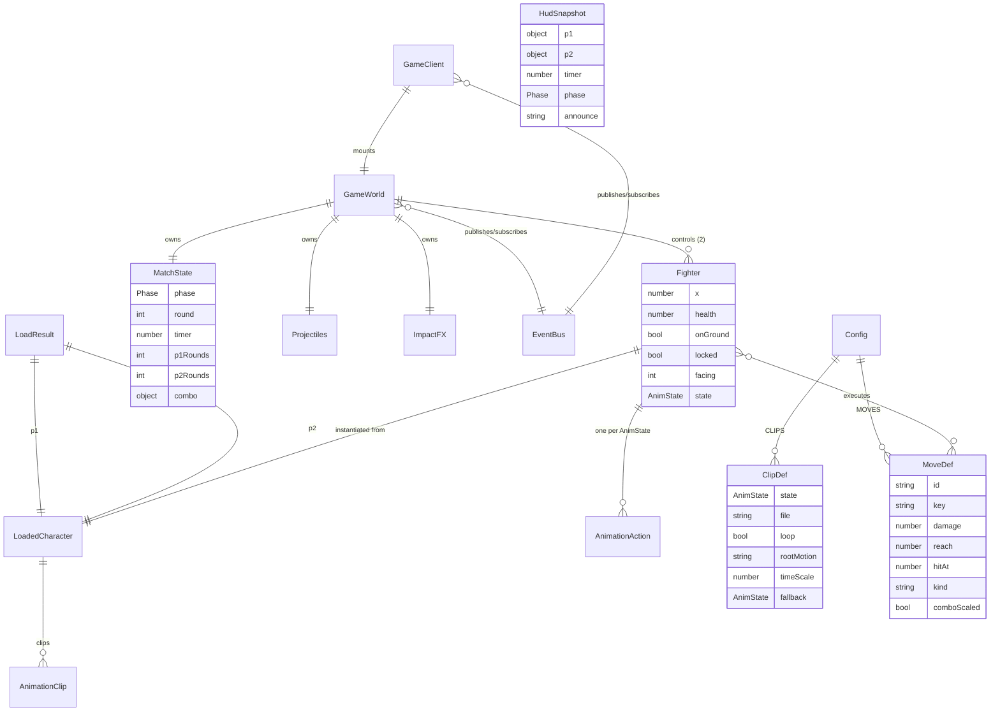
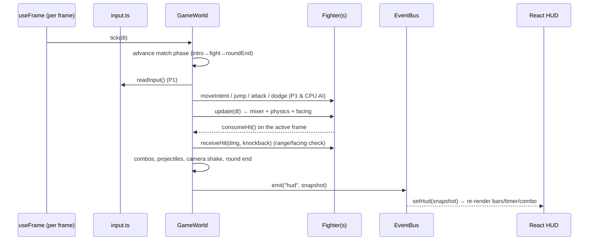
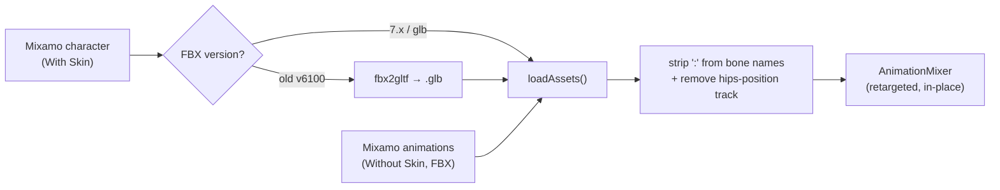

# NEON CLASH — 3D Browser Fighting Game

A Street-Fighter-style **3D fighting game that runs in the browser**, built with **Next.js + Three.js (react-three-fiber)**. Two motion-captured fighters trade punches, kicks, combos and fireballs on an animated neon street, with health bars, rounds, a CPU opponent, and a full on-screen move list.

> Realistic characters + smooth motion come from **3D skeletal animation** (Mixamo mocap clips blended at runtime) — not 2D sprites.

---

## ✨ Features

- **Real 3D characters** with skeletal animation, auto-scaled and grounded to the stage.
- **Smooth animation state machine** — idle / walk / jump / 9 attacks / block / hit / KO crossfade seamlessly via `AnimationMixer`.
- **Full moveset**: Jab, Cross, Kick, Low Sweep, Slash, Smash, Combo, Uppercut, **Fireball (projectile)**, plus **Dodge** and **Backflip** (both with i-frames).
- **Combo system** — chain attacks within a window; finishers scale damage with your hit count.
- **CPU opponent** with an aggressive, reactive AI (approaches, blocks, dodges, zones with fireballs).
- **Best-of-3 rounds**, round timer, KO / time-out / draw resolution, rematch.
- **Animated street stage** — parallax city skyline, neon signs, drifting embers, passing car-light streaks, street lamps.
- **Juicy feedback** — impact sparks, camera shake, combo pop-ups.
- **Polished UI** — neon main menu, fighting-game HUD (chip-trail health bars, round pips), pause & result overlays, collapsible on-screen controls.
- **Graceful asset fallback** — runs with a CC0 placeholder character if no models are present.

---

## 🧱 Tech Stack

| Layer | Tech |
|-------|------|
| Framework | Next.js 14 (App Router) · React 18 · TypeScript |
| 3D | Three.js 0.169 · @react-three/fiber · @react-three/drei |
| Styling/UI | Tailwind CSS |
| Assets | Mixamo (characters + mocap), glTF/FBX |
| Tooling (dev) | `fbx2gltf` (asset conversion) · `puppeteer-core` (headless verification) |

---

## 🚀 Quick Start

```bash
npm install
npm run dev
# open http://localhost:3000
```

The game runs immediately. Without character files it uses a built-in placeholder; see **[Adding characters](#-adding-your-own-characters)** to drop in realistic fighters.

```bash
npm run build && npm start   # production
```

---

## 🎮 Controls (Player 1)

| Movement | Key | Attacks | Key |
|---|---|---|---|
| Move | `A` / `D` | Jab | `J` |
| Jump | `W` | Cross | `U` |
| Block | `S` | Kick | `K` |
| Dodge (i-frames) | `Shift` | Low Sweep | `I` |
| Backflip (i-frames) | `Q` | Slash | `H` |
| Pause | `Esc` | Smash | `P` |
| | | Combo | `L` |
| | | Uppercut | `O` |
| | | Fireball | `F` |

Player 2 is the CPU. (Online multiplayer is planned — it will reuse the P1 bindings.)

**Rules:** 100 HP · 60s rounds · best of 3 · chain hits within ~1.7s for combos (Combo/Uppercut/Smash scale with the count).

---

## 📁 Project Structure

```
web-game/
├─ public/models/        # character + animation assets (.glb/.fbx) + README
├─ scripts/              # headless-browser verification scripts (puppeteer)
├─ docs/
│  └─ ARCHITECTURE.md    # deep-dive on how it all fits together
└─ src/
   ├─ app/               # Next.js App Router (layout, page, globals.css)
   ├─ components/        # React UI layer (DOM overlays)
   │  ├─ GameClient.tsx  #   top-level orchestrator / screen state machine
   │  ├─ MainMenu.tsx · HUD.tsx · ControlsBar.tsx
   │  ├─ LoadingScreen.tsx · PauseOverlay.tsx · ResultOverlay.tsx · SetupGuide.tsx
   └─ game/              # the engine (Three.js, framework-agnostic where possible)
      ├─ config.ts       #   all tuning + data tables (WORLD, RULES, CLIPS, MOVES…)
      ├─ types.ts        #   shared types
      ├─ EventBus.ts     #   typed pub/sub bridging the 3D world ↔ React UI
      ├─ input.ts        #   keyboard manager (held + edge-triggered)
      ├─ loadAssets.ts   #   model/clip loader, retargeting, fallback
      ├─ Fighter.ts      #   per-fighter controller + animation state machine
      ├─ GameWorld.tsx   #   the per-frame game loop (input, AI, hits, rounds)
      ├─ GameCanvas.tsx  #   <Canvas> + renderer setup
      ├─ StreetStage.tsx #   animated street/city scene
      ├─ ImpactFX.ts     #   hit-spark particle pool
      └─ Projectiles.ts  #   fireball pool
```

---

## 🏗️ Architecture

React owns the **DOM/UI** (menus, HUD). Three.js owns the **3D world** (fighters, stage). They never touch each other's internals — they talk only through a typed **EventBus**. This keeps the game loop out of React's render cycle (no re-renders per frame).



### Data model (core entities & relationships)



### One frame of the game loop



See **[docs/ARCHITECTURE.md](docs/ARCHITECTURE.md)** for the full module-by-module breakdown (state machine, hit detection, AI, asset retargeting, extension guide).

---

## 🧍 Adding Your Own Characters

The realism comes from the **character model + mocap clips**. They live in `public/models/` and are loaded by filename (see `CLIPS` / `MODELS` in [`src/game/config.ts`](src/game/config.ts)). Full instructions and the file table are in **[public/models/README.md](public/models/README.md)** and the in-game **"Add realistic characters"** button.

**Asset pipeline:**



**Requirements for new characters:**
- Use a **`mixamorig` skeleton** (so the shared animation clips retarget onto it).
- Provide **FBX 7.x or glb**. If you have an old FBX (`FBX version not supported, FileVersion: 6100`), convert it:
  ```bash
  node -e "require('fbx2gltf')('public/models/yourchar.fbx','public/models/fighter1.glb',['--binary','--pbr-metallic-roughness']).then(console.log)"
  ```
- The loader tries `fighter1.glb` then `fighter1.fbx` (same for `fighter2`).

---

## 🔧 Configuration & Tuning

Almost everything is data-driven in [`src/game/config.ts`](src/game/config.ts):

- `WORLD` — gravity, speeds, jump, fighter height, hit-stun, dodge/backflip.
- `RULES` — health, round time, rounds-to-win, combo window.
- `PROJECTILE` — fireball speed / damage / lifetime.
- `CLIPS` — animation-state → file mapping (+ loop, root-motion, time-scale, fallback).
- `MOVES` — attacks: damage, reach, hit timing, knockback, key binding, combo-scaling.
- `MODELS` — character base filenames.

---

## 🧪 Verification Scripts

Headless-browser checks (drive the real game in Chrome via `puppeteer-core`):

```bash
node scripts/verify.mjs   out.png   # boot, start a fight, screenshot, dump console
node scripts/interact.mjs out.png   # drive every move + fireball, assert no errors
node scripts/probe.mjs              # check static asset serving (HEAD/GET)
```

> They expect a Chrome install path and a running dev server on :3000; tweak the path at the top of each script if needed.

---

## 🩹 Troubleshooting

| Symptom | Cause / Fix |
|---|---|
| Characters are a gray placeholder | No models found, or model failed to load → using CC0 Xbot fallback. Add files to `public/models/`. |
| `FBX version not supported, FileVersion: 6100` | Old FBX format. Convert to glb with `fbx2gltf` (see asset pipeline). |
| Character invisible but combat works | Animation hips-position units mismatch — the loader removes that track; ensure clips are Mixamo and re-loaded. |
| Character in a T-pose | Idle clip not playing — ensure `fighting_idle.fbx` (or its fallback) loaded. |
| Animations don't move the model | Skeleton isn't `mixamorig` — re-export the character from Mixamo. |

---

## 🗺️ Roadmap

- Online multiplayer (reuses P1 controls)
- Knockdown → get-up flow, per-character stats
- Sound effects & music
- Character-select screen, mobile touch controls

---

## 📜 Credits & Licensing

- **Animations & characters:** [Adobe Mixamo](https://www.mixamo.com) (free with an Adobe account). Mixamo's license governs redistribution — raw asset files are **git-ignored** here by default.
- **Fallback character:** three.js `Xbot.glb` example asset (CC0-ish, for development).
- **Engine:** [Three.js](https://threejs.org) · [react-three-fiber](https://github.com/pmndrs/react-three-fiber) · [Next.js](https://nextjs.org).
- Code in this repo: add your own license.
